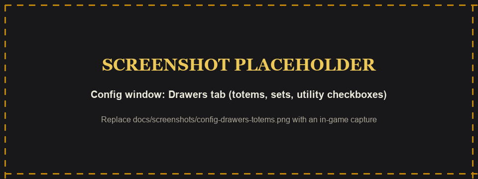
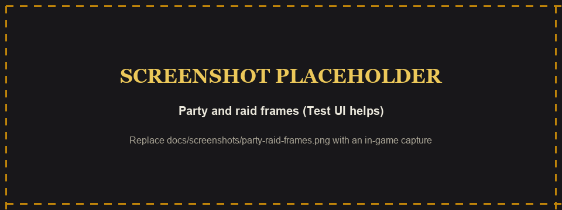
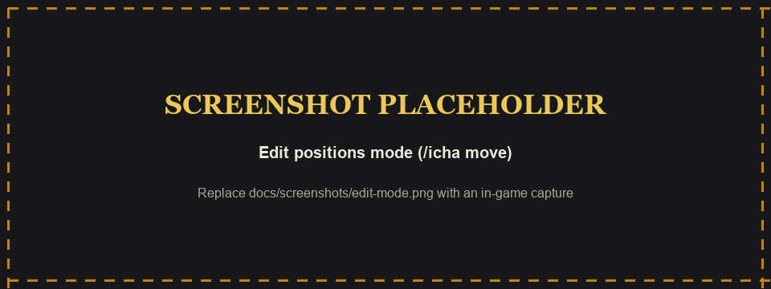
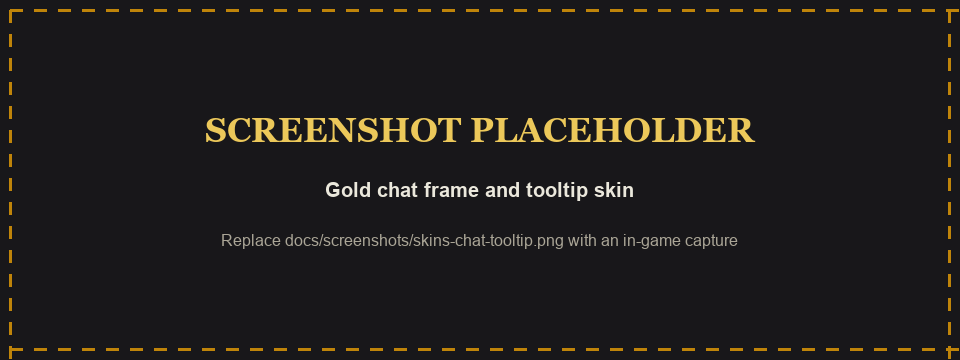

# IchaUI - Complete UI Suite for Turtle WoW (1.12)

A full interface replacement for the 1.12 client (Turtle WoW / RavenCraft): action bars, hero bars and drawers, unit frames with a combat tracker, a Shaman totem bar, minimap skin and button drawer, XP / reputation bar, buff bars, Smart Tab, Smart Mark, and one gold theme across chat, tooltips and frames. Everything is set up in one window: type `/iui`.


> **About the images:** anything named `preview-*.png` is an **offline preview render** built from the addon's real textures (`tools/render_previews.py`). It is not an in-game screenshot. Images marked **SCREENSHOT PLACEHOLDER** are waiting for in-game captures.


---

## Contents

- [Requirements](#requirements)
- [Install](#install)
- [First run](#first-run)
- [Feature tour](#feature-tour)
  - [Action bars](#action-bars-ichaui_bars)
  - [Hero bars](#hero-bars-ichaui_hero)
  - [Drawers and shape styles](#drawers-and-shape-styles)
  - [Custom drawers](#custom-drawers-ichaui_customdrawers)
  - [Shaman totem bar and extras](#shaman-totem-bar-and-extras-ichaui_shaman)
  - [Unit frames](#unit-frames-ichaui_unitframes)
  - [Combat tracker](#combat-tracker)
  - [Buff bars](#buff-bars-ichaui_buffbars)
  - [Minimap](#minimap-ichaui_minimap)
  - [XP / reputation bar](#xp--reputation-bar-ichaui_xp)
  - [Smart Tab](#smart-tab-ichaui_smarttab)
  - [Smart Mark](#smart-mark-ichaui_smartmark)
  - [Edit positions and the frame editor](#edit-positions-and-the-frame-editor)
  - [Skins: gold theme, chat, tooltips, frames](#skins-gold-theme-chat-tooltips-frames)
  - [Combat assist](#combat-assist)
- [Keybinds](#keybinds)
- [Slash commands](#slash-commands)
- [Saved settings, profiles and defaults](#saved-settings-profiles-and-defaults)
- [FAQ / troubleshooting](#faq--troubleshooting)
- [Credits](#credits)
- [Screenshots to capture](#screenshots-to-capture)

---

## Requirements

- **WoW 1.12.1 client** (`## Interface: 11200`), built and tested on **Turtle WoW / RavenCraft**.
- No required libraries. Every module depends only on the `IchaUI` core, plus:
  - `IchaUI_CustomDrawers` needs `IchaUI_Hero`, because it uses the hero ability picker.
  - `IchaUI_SmartTab` needs `IchaUI_UnitFrames`, because it cycles the combat tracker.

### Optional client mods

Everything loads and works on a plain 1.12 client. These mods unlock or improve specific features:

| Mod | What it adds in IchaUI |
|-----|------------------------|
| **SuperWoW** | Unit GUIDs, which the **focus frame** needs to remember its unit and which let the **combat tracker**, **Smart Tab** and **Smart Mark** tell same-named mobs apart. `UNIT_CASTEVENT` cast bars and swing timers for target, target-of-target and party. Debuff spell IDs for durations. `mouseover` casting for hero binds. Totem range from `UnitPosition` (Totemic Recall and the "skip live in-range totems" rule). Vendor sell price in tooltips. |
| **Nampower** | Soft-casting on a unit token, so `/focuscast` works without swapping your target. |
| **ClassicAPI** | Better cast info for remote units (RavenCraft). |
| **SuperCleveRoidMacros** | `/cast [@focus] Spell` and `/target [@focus]` against the IchaUI focus. |

Without SuperWoW, the combat tracker and Smart Tab fall back to name-based tracking and plain Tab, cast bars fall back to the combat log, and Smart Mark de-duplicates by name.

---

## Install

1. Download `IchaUI-3.3.0.zip` from the [latest release](https://github.com/brutaliccus/IchaUI/releases/latest).
2. **Exit WoW completely.**
3. Extract the zip into `World of Warcraft\Interface\AddOns\`. The zip already contains the addon folders at its root, so you should end up with:
   ```
   Interface\AddOns\IchaUI
   Interface\AddOns\IchaUI_Bars
   Interface\AddOns\IchaUI_BuffBars
   Interface\AddOns\IchaUI_CustomDrawers
   Interface\AddOns\IchaUI_Hero
   Interface\AddOns\IchaUI_Minimap
   Interface\AddOns\IchaUI_Shaman
   Interface\AddOns\IchaUI_SmartMark
   Interface\AddOns\IchaUI_SmartTab
   Interface\AddOns\IchaUI_UnitFrames
   Interface\AddOns\IchaUI_XP
   ```
   Do **not** end up with `AddOns\IchaUI-3.3.0\IchaUI\...`. If you see that, move the inner folders up one level.
4. Start the client. **A full client restart is required** after installing or updating: 1.12 only discovers new `.toc` files and new `.tga` textures at startup, so `/reload` is not enough.
5. On the character select screen, open **AddOns** and make sure the IchaUI modules are enabled. Each module is optional except `IchaUI` itself. For example, non-Shamans can disable `IchaUI - Shaman`.

**Upgrading:** delete the old `IchaUI*` folders first, then extract. Your settings live in `WTF` and are kept.

---

## First run

- Type **`/iui`** to open the configuration window. `/icha options` and `/ichaui config` open it too.
- A fresh install starts from a complete baked layout, so the bars, frames, minimap and totem bar are already placed.
- The window has a tab column on the left: **Bars, Hero, Buffs, Frames, Drawers, Map, Combat, Mark, Skin**. Tabs for modules you have disabled are hidden.
- The **search box** filters settings by name across tabs.
- **Test UI** (top right) shows preview **[Party]** and **[Raid]** frames, so you can style group frames while solo.
- The **profile bar** at the bottom saves and loads named profiles (see [profiles](#saved-settings-profiles-and-defaults)).
- Most sliders have a number box next to them. Type a value and press Enter.
- Key capture buttons take any key, mouse button (M3, M4, M5) or mouse wheel, with Shift, Ctrl or Alt. Press Esc to cancel.

<!-- SCREENSHOT: docs/screenshots/config-bars.png — replace with in-game capture -->


---

## Feature tour

### Action bars (`IchaUI_Bars`)

A replacement for the default action bars, built around the hero bar.

- **Layout:** bars 1-3 sit to the left of the hero bar and grow right to left; bars 4-6 sit on the right and grow left to right. Side bars stay attached to the hero cluster unless you detach them.
- **Add bar / Remove** creates more bars while free action slots remain (beyond the default six).
- **Scale, Gap and Strata** (Bars tab). Strata sets the icon layer for action bars, hero bars, the totem bar and every drawer.
- **Per-bar style:** Shape (all 13 shapes below), **Layout: Grid or Radial**, with **Spread, Arc and Sh Rot** (shape rotation) sliders for radial layouts.
- **Hotkeys** toggles keybind text on the buttons. **Bind** enters hover-bind mode: hover a button and press a key.
- **Out-of-range tint:** icons turn grey when your target is out of range (Combat tab, **OOR grey icons**).
- **Equipped glow:** an item on your bars that you are wearing gets a quality-colored inner glow.
- **Bongos:** if `Bongos_ActionBar` is installed, IchaUI hides it. `/icha show` brings Bongos back and hides IchaUI's bars; `/icha hide` reverses that.

### Hero bars (`IchaUI_Hero`)

The centerpiece: a grid of large buttons where each button holds **several abilities, each with its own key**. Pressing a key casts that ability and swaps the button's face to it.

- **Grid:** 1-12 columns by 1-5 rows (default 4 by 2). Growing the grid reveals empty cells; shrinking drops only the cells outside the new size.
- **Up to five hero bars.** **Add** and **Remove** on the Hero tab. Each extra bar reserves its own block of action slots and shares the scale, columns, rows and setup controls.
- **Hero setup:** shows the bar for editing. Drag a slot to move its abilities. **Edit abilities** opens the **Hero ability picker**: spells, **macros** and **usable bag items** (consumables). Pick several, set a key for each, then **Save** (Cancel discards the draft).
- **Targeting per key:** spell keys can cast on **Target**, **Mouseover** or **Focus**. Mouseover uses SuperWoW's `mouseover` token, then the unit under a hovered frame. Missing mouseover falls back to your target; an empty focus does not cast.
- **Shape and Layout** (Grid or Radial, with Spread, Arc and Sh Rot) follow the hero bar you have selected.
- **Scale:** `/icha heroscale <n>` or the Hero tab slider.

<!-- SCREENSHOT: docs/screenshots/config-hero.png — replace with in-game capture -->


### Drawers and shape styles

"Drawers" are closed buttons that pop out a tray of more buttons: the totem element drawers, imbue, shield and utility drawers, the resists drawer, the minimap button drawer, and your own custom drawers.

**Shapes.** Every bar, hero bar and drawer can use one of 13 button shapes:

| Group | Shapes |
|-------|--------|
| Gold theme | **Rectangle**, **Square**, **Circle** (tracker ring), **Tooltip Ring**, **Portrait** |
| pfUI edges | **pfUI Square**, **pfUI Blizz** |
| Circular frame art | **Metal Plain**, **Metal Eternium**, **Metal Bronze**, **WoWUI**, **Wood Boards**, **Generic Target** |

Round shapes draw the icon as a round portrait so nothing pokes out past the ring. The gold shapes follow the Skin tab's theme color; frame-art shapes keep their natural colors.

**Per-drawer style** (the rows under each drawer on the Drawers and Map tabs, and the edit-mode popup):

- **Open** direction: Up, Right, Down, Left or **Radial**, with **Spread**, **Arc** and **Sh Rot** for radial trays.
- **Shape**, **Strata**, **Text** size, **Rows / Columns**, and separate scales for the **closed button** and the **open tray**.
- In **Edit positions** (`/icha move`), **right-click** a drawer's mover, handle or Lock chip to open a settings popup for that drawer. It writes the same settings as the tab rows.

### Custom drawers (`IchaUI_CustomDrawers`)

Build your own drawers of anything: spells, macros or bag items.

- Drawers tab, **Custom drawers**: name it (default *My drawer*), then **Pick abilities** opens the hero ability picker.
- The closed button is only a toggle handle. Each tray entry casts on its own click, then the tray closes.
- Options per drawer: **Open** direction (with radial Spread and Sh Rot), **Shape**, **Title: Show / Hide**, **Label: Top / Bottom**, **Cols** and **Rows**, and **Delete**.
- Drag the handle to place it. Positions are saved per drawer.

### Shaman totem bar and extras (`IchaUI_Shaman`)


<!-- SCREENSHOT: docs/screenshots/totem-bar-ingame.png — replace with in-game capture -->


**The bar.** Four element slots (Earth, Fire, Water, Air) with live duration timers. An empty slot shows a skull icon.

- **Element drawers:** hover a slot to open its drawer of every totem of that element you know. **Click** a totem to cast it. **Right-click** a drawer row to make it that slot's "throw" totem.
- **Shift drawers:** with this on, drawers open only while you hold Shift (this also applies to the imbue, shield and utility drawers).
- **Cast / progress ring:** a thin ring around the slot shows the cast and tick progress (Searing attacks, Mana Spring and Healing Stream pulses, Fire Nova detonation), with a spark at the leading edge. The color follows the element: fire orange, water blue, poison-cleansing green, disease-cleansing yellow, Tremor earth, air cyan. The ring fits each shape, including square and pfUI edges.
- **Cooldown badge** on a slot whose totem is on cooldown (**CD badge** scale slider).
- **Sizes:** Scale, Size, Gap, Text, **T.strata** (layer for the timer numbers), **Drawer** size and **D.Gap**.

**Totem sets with paging arrows.**

- Drawers tab, **Totem sets:** `<` and `>` page through sets; **Add**, **Remove**, and a **name box** (press Enter to save the name). Click an element icon to pick the next totem for that set; right-click picks the previous one.
- With 2 or more sets, **paging arrows** appear on each side of the bar.
- **Throw current** (default key **T**) casts the current set. Each set also gets its own **Throw** key (sets 1-10).
- **A throw skips totems that are already down and in range**, and recasts the rest. Press it again to fill what is missing.
- `/icha totems next | prev | throw [N]` does the same from macros.

**Fire Twist.** Right-click the fire slot to cycle **Off, then Fire Nova followed by Searing, then Fire Nova followed by Magma**. Casting from the fire slot (or its bind) drops Fire Nova and queues the follow-up totem for the detonation moment. Improved Fire Totems ranks are included in the timing. The fire slot shows a dedicated Fire Twist icon while twisting is armed.

**Binds.** Drawers tab:

- **Slot binds** (Earth, Fire, Water, Air) cast whichever totem is selected on that slot.
- **Spell binds** give every totem its own key, so you can drop totem buttons from your action bars entirely.

**Totemic Recall.** An icon appears only after you have been out of range of every live totem for **Wait** seconds (out of combat), and only when Recall is ready. Click it to cast. **Recall: On / Off**, **Move icon**, and **Icon** size are on the Drawers tab.

**Imbue, Shield and Utility drawers** are separate, movable circle widgets (not attached to the totem bar):

- **Imbue:** Rockbiter, Flametongue, Frostbrand, Windfury Weapon.
- **Shield:** Lightning, Water, Earth Shield.
- **Utility:** Water Walking, Water Breathing, Far Sight, Astral Recall, Reincarnation, Ancestral Spirit. **Show in drawer** checkboxes choose which of these appear.
- Each widget has Move, Show, Hide, its own Open direction and shape style, and **Text: On / Off** for imbue and shield.
- **Warnings:** the widget turns red when the imbue has under 60 s left, the shield is at 2 charges or fewer, a water buff has under 60 s left, or a needed reagent is at 0.

**Shield binds** (Bars tab): three keys for Lightning, Water and Earth Shield. The shield widget flips to whichever you cast last.

**Resists drawer** (Drawers tab, **Resists**): **Mob stats: On / Off** adds a drawer of the target's resistances to the target frame. **Minimal resists** tucks them by the caret when the drawer is closed. It has Open direction and radial controls too.

<!-- SCREENSHOT: docs/screenshots/config-drawers-totems.png — replace with in-game capture -->


### Unit frames (`IchaUI_UnitFrames`)

<!-- SCREENSHOT: docs/screenshots/unit-frames.png — replace with in-game capture -->


- **Frames:** Player (round portrait with a gold ring), Target, Target-of-Target, **Focus**, **Party**, **Raid**, and the **Combat** tracker.
- Thick health bars, thin power bars, class colors, and choice of health, power and cast-bar textures.
- **Cast bars** for player, target, ToT, focus and party (SuperWoW events, with a combat-log fallback), plus **swing timers**.
- **Frames tab editor** (one sub-tab per frame): Enabled, Width, Height, Scale, Columns and Growth for group frames, Health ratio, Health and Power height, Portrait on/off with scale, ring scale and offsets, badge settings, **shield orbs** (Spread, Sh Rot, X, Y), level on bar, name and text scales and offsets, Health percent, Power text, and cast bar length, scale and offsets.
- **Buffs and debuffs** per frame: anchor, scale, X/Y, number shown, per row, padding. A **filter** per frame cycles **All, My (only your own auras), Whitelist, None** (for raid debuffs, *None* becomes **Dispel**: only what you can dispel), with editable **Buff list** and **Debuff list** whitelists.
- **Raid / watch debuffs** (Skin tab): one debuff name per line. These are watched on the raid frames regardless of the filter.
- **Leader, loot master and raid mark icons:** each can be shown or hidden, anchored to the frame or the portrait, and offset. **Role fades:** **Combat hide** fades those icons in combat, and **Hover only** shows them only while you mouse over the frame.
- **Focus:** `/setfocus` remembers a unit (friendly or hostile) by GUID until it dies; `/clearfocus`, `/targetfocus`, and `/focuscast <spell>`. `/target focus` in macros is hooked too.
- `/icha uf blizzard` toggles the default Blizzard frames.

<!-- SCREENSHOT: docs/screenshots/party-raid-frames.png — replace with in-game capture -->


<!-- SCREENSHOT: docs/screenshots/config-frames.png — replace with in-game capture -->


### Combat tracker

A grid of small unit frames for **every enemy you or your party / raid is fighting, plus any raid-marked hostile**. The default is 1 column by 10 rows; its look is set on the **Combat** sub-tab of Frames.

- Row colors show threat at a glance: **On you** (default red) and **Loose** (on nobody in your group, default yellow). Both colors are editable on the Combat tab.
- Rows are tracked per GUID with SuperWoW (same-named mobs get their own rows). The tracker is also what **Smart Tab** cycles (below).

<!-- SCREENSHOT: docs/screenshots/combat-tracker.png — replace with in-game capture -->


### Buff bars (`IchaUI_BuffBars`)

- Player **buff** and **debuff** bars with rectangular icons, gold borders, duration under each icon and stacks bottom-right. Debuffs show their dispel type.
- **Right-click a buff to cancel it.**
- Buffs tab: Scale, Gap, Row, Cols, Text, Move. Also `/icha buffs move | scale | gap | cols`.

<!-- SCREENSHOT: docs/screenshots/buff-bars.png — replace with in-game capture -->


### Minimap (`IchaUI_Minimap`)


**Skin** (Map tab):

- **Minimap: On / Off**, Move, Reset, **MM Scale** and **MM Size**.
- **Shape** opens a preview grid of every frame; click one to use it. There are 26 shapes: **Square** (gold, the default), **Circle** (portrait ring), 11 circular frame arts (WowUI, Wood Boards, Pandaren Training, Metal Plain, Metal Eternium, Metal Bronze, Horde, Generic Target, Fire, Arcane Flash, Arcane), 9 SexyMap-style masks (SM Circle, SM Large Circle, SM Faded Square, and SM Top, Top Left, Top Right, Bottom, Bottom Left, Bottom Right), 3 pfUI edges (Square, Blizz, No Top) and **Tooltip Ring**.
- **Tint** recolors the frame art.
- **Zone title** and **Clock:** each can be detached, moved, scaled, hidden or reset. They are click-through while locked.

**Button drawer:** collects the minimap buttons from other addons into a gold drawer tray under the map (it replaces TurtleSnacks / MinimapButtonBag-style collectors).

- **Drawer: On / Off**, **Open/Close**, **Rescan**, **Open** direction (default Down), and radial Spread, Arc and Sh Rot.
- A per-button list lets you mark each addon button **Drawer** (in the tray) or **Free** (on the minimap). **Move** unlocks every icon for dragging, **Reset** puts one button back, and **Reset all positions** resets them all.

### XP / reputation bar (`IchaUI_XP`)


- A separate, movable bar: 20 segments, gold edge, purple XP, and rested XP shown in blue **past** your current XP (green at 150% rested).
- **Hover** to show the numbers.
- **Right-click the bar to switch between XP and reputation.** Reputation mode shows your **watched faction** in its standing color (pick one in the Reputation pane). At max level a watched faction always wins.
- Bars tab: Width, Height, Scale, Move XP, Show and Hide. Also `/icha xp move | scale 1 | width 400 | height 14 | show | hide`.

### Smart Tab (`IchaUI_SmartTab`)

Makes **Tab** cycle the combat tracker instead of whatever the default Tab picks.

- **Smart Tab: On** takes over the Tab key. When the tracker is empty or nothing in it is targetable, your previous Tab binding runs as normal.
- The order is by **current HP**, highest first. **Lowest first** reverses it.
- **Tank mode** puts enemies that are *not* on you first (on a party or raid member, then loose), then the ones already on you. Lowest first flips the HP order inside each group.
- When a mob dies, the next Tab starts again at the front of the order.
- All toggles are on the **Combat** tab. Tank mode and Lowest first are greyed out while Smart Tab is off.

### Smart Mark (`IchaUI_SmartMark`)


Hold a key and **sweep the mouse over a pack**: every unit you touch gets the next raid icon.

- Two binds: **Smart Mark** marks **enemies only**, and **Smart Mark Friendly** marks **friendly units only**.
- Binds **must include Shift, Ctrl or Alt** (for example `SHIFT-Q`). Hold the modifier to keep marking; release it to stop.
- Units that already have a mark are skipped. With SuperWoW, each mob is tracked by GUID, so same-named mobs are marked individually.
- **Icon order** (Mark tab): separate **Enemy order** and **Friendly order** lists, each with 8 rows. **Up / Dn** reorder, a **checkbox** disables an icon, **Reset** restores the default, and **Copy enemy order** copies it to the friendly list. Icons are used top to bottom and wrap after the last checked one.
- Default order: Skull, Cross, Moon, Circle, Square, Diamond, Star, Triangle.
- In a raid you need leader or assist to mark.
- Set the keys on the Mark tab, or in Esc > Key Bindings > **IchaUI Smart Mark**. **Smart Mark: On / Off** disables it without losing the binds.

<!-- SCREENSHOT: docs/screenshots/config-mark.png — replace with in-game capture -->


### Edit positions and the frame editor

- **`/icha move`** (or **Edit positions** on the Bars tab) unlocks everything movable: action bars, hero bars, the totem bar, drawers and their handles.
- Bars **snap** to each other (14 px). Attached side bars keep a consistent gap measured from each bar's real edges. A snapped bar gets nudge arrows that move it 1 px at a time, and the nudge is saved with the snap.
- **Right-click a bar** in edit mode for its scale, opacity and grid. **Right-click a drawer** for its drawer popup.
- **Detach** a bar to place it freely on the screen.
- **Escape saves** the positions and leaves edit mode.
- Unit frames have their own **Move / Show / Hide** buttons, X/Y boxes and arrow nudges on the Frames tab, plus `/icha uf <frame> move`.

<!-- SCREENSHOT: docs/screenshots/edit-mode.png — replace with in-game capture -->


### Skins: gold theme, chat, tooltips, frames

All on the **Skin** tab:

- **Gold:** one theme color for every border, ring and chrome piece, plus a **Fill** color for the dark panels behind them. Brighter gold text follows the border. Nothing changes until you pick a color.
- **Chat skin:** gold chrome around the chat frame, tabs skinned in place, the edit box parked above the frame, and scroll and menu buttons hidden. **Border: On / Off** and background **Alpha**. Also `/icha chat on | off | alpha <n>`.
- **Tooltips:** gold border and dark fill on GameTooltip and common tooltip frames (including late ones such as AtlasLoot). It shows the **vendor sell price** when the client provides it (SuperWoW), and the comparison tooltips show what you have equipped in the matching slots (both rings, both trinkets, both hands for two-handers).
- **TWThreat + Caw DPS skin:** gold tooltip-border chrome on those addons' windows and dropdowns. The Character and Spellbook frames stay stock.

<!-- SCREENSHOT: docs/screenshots/skins-chat-tooltip.png — replace with in-game capture -->


### Combat assist

Combat tab toggles (gold = enabled):

- **Auto-dismount:** if a cast fails because you are mounted, IchaUI dismounts and retries the cast once.
- **Melee start attack:** melee abilities also start auto-attack.
- **OOR grey icons:** action-bar icons tint grey when your target is out of range.
- **Bar tips:** in combat, action-bar tooltips stay hidden unless you hold Shift.
- **Smart Tab**, **Tank mode**, **Lowest first**, and the tracker **On you** and **Loose** colors (see [Smart Tab](#smart-tab-ichaui_smarttab)).

---

## Keybinds

Everything below shows up in **Esc > Key Bindings** under the **IchaUI** and **IchaUI Smart Mark** headers. Most of them are easier to set from inside `/iui` with the click-to-bind buttons, which write the same bindings.

| Binding | Where to set it in `/iui` | What it does |
|---------|---------------------------|--------------|
| `ICHA_HEROBIND1` - `ICHA_HEROBIND96` | Hero tab > Hero setup | Hero button keys. Assigned for you when you give an ability a key in the hero picker; you don't need to set these by hand. |
| **Throw Current Totem Set** (`ICHA_THROWTOTEMS`) | Drawers > Throw current | Throws the set you are paged to (default key **T**). |
| **Throw Totem Set 1-10** (`ICHA_THROWTOTEMSET1`-`10`) | Drawers > Totem sets > Throw *name* | Throws that set directly. The Key Bindings menu shows each set's name, or "(not created)". |
| **Totem Slot: Earth / Fire / Water / Air** (`ICHA_TOTEMBIND_*`) | Drawers > Slot binds | Casts the totem selected on that slot. The fire slot follows Fire Twist when it is armed. |
| **Totem: *name*** (`ICHA_TOTEMCAST1`-`23`) | Drawers > Spell binds | One key per totem. Earth: Stoneskin, Earthbind, Stoneclaw, Strength of Earth, Tremor. Fire: Searing, Fire Nova, Magma, Frost Resistance, Flametongue. Water: Healing Stream, Mana Spring, Poison Cleansing, Disease Cleansing, Fire Resistance, Mana Tide. Air: Windfury, Grounding, Grace of Air, Windwall, Nature Resistance, Tranquil Air, Sentry. |
| **Shield Bind 1 (Lightning) / 2 (Water) / 3 (Earth)** (`ICHA_SHIELDBIND1`-`3`) | Bars > Shield binds | Casts that shield and flips the shield widget to it. |
| **Shock Bind 1 (Earth) / 2 (Frost) / 3 (Flame)** (`ICHA_SHOCKBIND1`-`3`) | none (legacy) | Kept for old keybind files. Put shocks on a hero button instead (Hero > Hero setup). |
| `ICHA_SMARTTAB` | Combat > Smart Tab | Set automatically: turning Smart Tab on moves your Tab key here. |
| **Smart Mark** (`ICHA_SMARTMARK`) | Mark > Enemy key | Hold to mark enemies under the mouse. Needs Shift, Ctrl or Alt. |
| **Smart Mark Friendly** (`ICHA_SMARTMARK_FRIENDLY`) | Mark > Friendly key | Hold to mark friendly units under the mouse. Needs Shift, Ctrl or Alt. |

---

## Slash commands

| Command | Usage |
|---------|-------|
| `/iui` | Open or close the configuration window. |
| `/icha`, `/ichaui` | With no argument, lists the sub-commands below. `/icha options` (or `option`, `config`, `opt`) opens the window. |
| `/icha move` (or `edit`) | Toggle Edit positions. |
| `/icha hotkeys` (or `hotkey`, `binds`) | Show or hide keybind text on action buttons. |
| `/icha bind` | Toggle hover-bind mode for action buttons. |
| `/icha scale <n>` | Action-bar icon scale, for example `/icha scale 0.85`. With no number, prints the current value. |
| `/icha gap <n>` (or `pad`) | Gap between action buttons, for example `/icha gap 2`. |
| `/icha heroscale <n>` | Hero bar scale, for example `/icha heroscale 1.55`. |
| `/icha show` / `/icha hide` | Show Bongos and hide IchaUI's bars, or the reverse (only matters with Bongos installed). |
| `/icha wipe` | Remove leftover per-slot WeakestAuras from very old IchaUI versions and rebuild the bars. |
| `/icha xp move \| show \| hide \| scale <n> \| width <n> \| height <n>` | XP bar. Width and height are pre-scale values (`w` and `h` work too). |
| `/icha uf [player\|target\|tot\|focus] move \| show \| hide \| scale \| width \| height <n>` | Single unit frames. |
| `/icha uf party move \| show \| hide \| scale \| width \| height \| pad <n>` | Party frames. |
| `/icha uf raid move \| show \| hide \| scale \| width \| height \| pad \| cols \| rows <n>` | Raid frames. |
| `/icha uf blizzard` | Toggle hiding of the default Blizzard unit frames. |
| `/icha totems move \| show \| hide \| clear` | Totem bar (`/icha totem` and `/ichatotems` also work). `clear` forgets the active-totem state. |
| `/icha totems throw [N]` (or `set`, `cast`) | Throw the current set, or set *N*. |
| `/icha totems next \| prev` | Page totem sets. |
| `/icha totems scale \| size \| gap \| text <n>` | Totem bar sizing. |
| `/icha imbue \| shield \| utility move \| show \| hide` | Shaman imbue, shield and utility widgets (`util` works too). |
| `/icha shieldbind` | Print your shield binds (rebind them on the Bars tab). |
| `/icha buffs move \| scale <n> \| gap <n> \| cols <n>` | Buff bars (`buff` and `debuffs` also work). |
| `/icha chat on \| off \| alpha <n>` | Chat skin border and background alpha. |
| `/setfocus` | Set focus to your current target. |
| `/clearfocus` | Clear the focus. |
| `/targetfocus` | Target your focus. |
| `/focuscast <spell>` | Cast a spell on your focus without changing target (needs SuperWoW or Nampower). |

Troubleshooting commands (you normally won't need them): `/iui maskdebug`, `/icha recalldebug`, `/icha uf healdebug`, and `/icha shock` (prints a note that shock binds moved to Hero setup).

---

## Saved settings, profiles and defaults

- **SavedVariables** (account-wide, in `WTF\Account\<ACCOUNT>\SavedVariables\IchaUI.lua`):
  - `IchaUIDB` holds your live settings for every module.
  - `IchaUIProfiles` is the **profile library** shared by every character on the account.
- **Profiles** (bar at the bottom of `/iui`): type a name and use **Save**, **Load**, **Delete** or **List**. Saving over an existing name asks you to click **Overwrite**. A profile is a snapshot of every IchaUI settings table, so you can keep, for example, a "Shaman raid" and a "Leveling" layout and switch between them. Loading a profile name that doesn't exist changes nothing.
- **Defaults:** a fresh install (no saved `IchaUIDB`) starts from a complete baked layout (`IchaUI\Defaults.lua`). When you update, only **missing** keys are filled from the defaults; your existing values are never overwritten.
- **Not part of the defaults:** keybinds (these live in WoW's own bindings), built totem sets, custom drawers and runtime state. Set those up once per character or account.
- **Start over:** exit the game and delete `WTF\Account\<ACCOUNT>\SavedVariables\IchaUI.lua` (and the `.bak` next to it). The next login starts from the defaults.

---

## FAQ / troubleshooting

**I installed or updated and something is missing, or a texture shows as a green or black square.**
Restart the client completely. 1.12 reads the list of `.toc` files and discovers new `.tga` files only at startup. `/reload` reloads Lua code and settings, but it will not pick up a new addon folder, a changed `.toc`, or a texture file that didn't exist at launch. Some shapes (thicker rings, the round Fire Twist icons) quietly fall back to older art until you restart.

**When is `/reload` enough?**
For settings changes and Lua-only updates to files the client already knows about. Everything in `/iui` applies live, and most of it needs no reload at all.

**My old action bar addon still shows, or buttons overlap.**
Run only one action-bar addon. IchaUI hides Bongos automatically (`/icha show` and `/icha hide` swap between them). Disable other bar addons (for example pfUI's action bars, Bartender-style addons or DiscordActionBars), or at least their bars. The same goes for unit frames (pfUI unit frames, Luna, and so on), minimap skins (SexyMap-style addons, MinimapButtonBag) and chat skins. Two addons skinning the same frame will fight.

**Where did my minimap buttons go?**
Into the button drawer under the minimap (the arrow tray). Click the arrow to open it. To keep a button on the map, mark it **Free** in the Map tab's button list, or turn **Drawer: Off**.

**The totem throw doesn't recast a totem.**
That's intended: a throw skips any totem that is already down and in range, and recasts the rest. Range detection needs SuperWoW. Without it, IchaUI relies on the totem timers.

**Smart Mark says it needs Shift, Ctrl or Alt.**
The bind must include a modifier, because holding the modifier is what keeps marking active. Use something like `SHIFT-Q`. In a raid you also need leader or assist.

**Smart Tab behaves like normal Tab.**
It only cycles the combat tracker, so with nothing in the tracker, your old Tab runs. Check that Smart Tab is **On** (Combat tab) and that the Combat frame is enabled on the Frames tab. SuperWoW makes the tracker much more reliable.

**`/focuscast` says it needs SuperWoW or Nampower.**
Vanilla's `CastSpellByName` can't target a unit token, so focus casting needs one of those DLL mods. `/targetfocus` always works.

**How do I preview party or raid frames while solo?**
Open `/iui` and click **Test UI**, then toggle **[Party]** and **[Raid]**.

**The config window is off-screen or too big.**
Drag it with the left mouse button to move it. It also closes with Esc.

**Lua errors?**
Please open an issue with the full error text (install an error catcher such as BugSack or use `/console scriptErrors 1`), your client (Turtle or RavenCraft), and which optional mods (SuperWoW, Nampower, ClassicAPI) you run.

---

## Credits

- **Author:** [brutaliccus](https://github.com/brutaliccus).
- **Minimap shapes:** SexyMap-style masks and the circular frame art (x4 set), plus pfUI's border edges, re-used as minimap and button shapes.
- **Blizzard UI textures** (tooltip border, tracking border, raid icons, status bars) are used in game from the client, and in the preview renders from exported copies.
- The Totemic Recall range logic follows the approach used by CallOfElements (SuperWoW `UnitPosition`).
- Built for the Turtle WoW and RavenCraft communities.

## Repository layout

```
IchaUI/ ... IchaUI_XP/     the addon folders (what the release zip contains)
docs/screenshots/          README images (preview renders and placeholders)
tools/sync.ps1             re-copy the addon folders from a live AddOns folder
tools/render_previews.py   rebuild the preview renders (needs Pillow)
tools/build_release.py     build dist/IchaUI-<version>.zip from the committed addon folders
```

The release zip contains only the addon folders; `docs/` and `tools/` are repository-only.

---

## Screenshots to capture

These README images are placeholders. Capture them in game (1920x1080 or larger, cropped to the subject) and save them over the files in `docs/screenshots/` with the same names. `python tools/render_previews.py` never overwrites existing placeholder files unless you pass `--placeholders`.

| File | What to capture |
|------|-----------------|
| `config-bars.png` | `/iui`, Bars tab |
| `config-hero.png` | `/iui`, Hero tab, ideally with the Hero setup picker open |
| `config-drawers-totems.png` | `/iui`, Drawers tab: totem sets, binds, and the utility checkboxes |
| `config-frames.png` | `/iui`, Frames tab (unit-frame editor) |
| `config-mark.png` | `/iui`, Mark tab (Smart Mark binds and icon order) |
| `unit-frames.png` | Player, target, target-of-target and focus frames |
| `party-raid-frames.png` | Party and raid frames (Test UI works) |
| `combat-tracker.png` | Combat tracker grid mid-pull, showing on-you and loose colors |
| `totem-bar-ingame.png` | Totem bar with timers and a running progress ring |
| `edit-mode.png` | `/icha move` edit mode |
| `buff-bars.png` | Buff and debuff bars |
| `skins-chat-tooltip.png` | Gold chat frame plus an item tooltip |

The `preview-*.png` renders (button shapes, totem bar, minimap shapes, XP bar, raid icon order) can stay, or be swapped for captures too.
