# IchaUI

A complete UI replacement for WoW 1.12: action bars, unit frames, nameplates, chat, minimap and more, all in one matching gold theme. Everything is configured in one window: type `/iui`.

Built for Shamans first (full totem bar with sets and Fire Twist), but every other module works for any class.

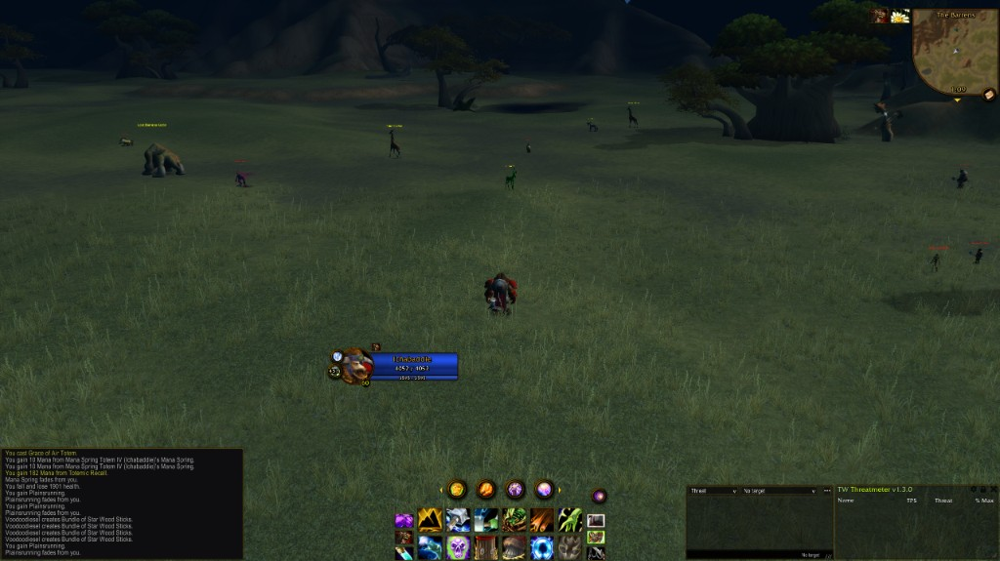

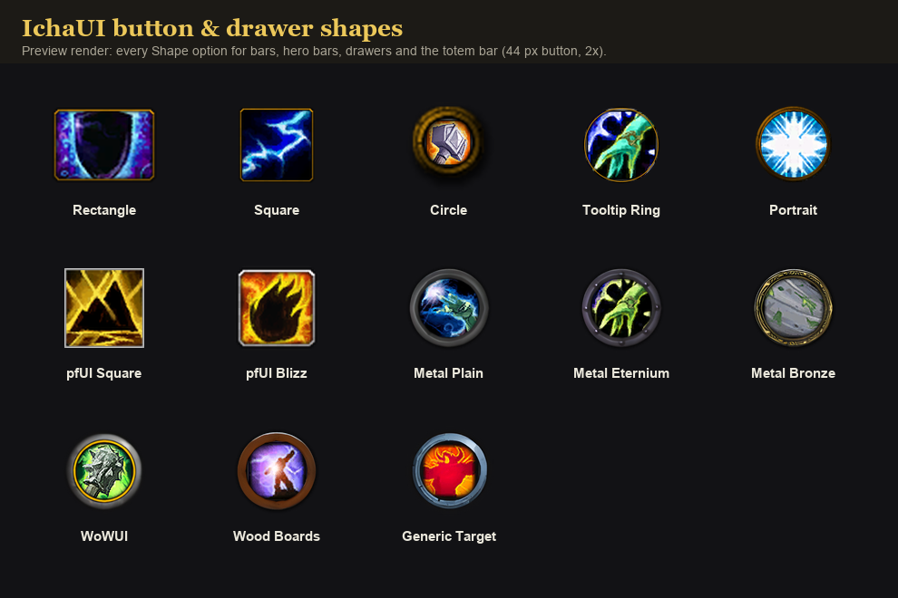

*13 button shapes, usable on any bar or drawer.*

## Features

Every module is its own addon, so you can turn off the ones you don't want.

**Action bars and Hero bars**
- Action bars that grow out from a central Hero bar, with 13 button shapes and grid or radial layouts.
- Hero bars: big buttons that hold several abilities, each with its own key. Cast on target, mouseover or focus.
- Custom drawers: pop-out trays of any spells, macros or bag items.
- Built-in cooldown numbers on your buttons.
- Hover-to-bind, out-of-range tint, and a glow on equipped items.

**Shaman**
- Totem bar with timers, element drawers and per-totem keybinds.
- Totem sets: page between sets and throw one with a single key. Totems already down and in range are skipped.
- Fire Twist, a Totemic Recall prompt, and imbue, shield and utility drawers with low-buff warnings.

**Unit frames**
- Player, target, target-of-target, focus, party and raid frames with cast bars and swing timers.
- Combat tracker: a list of every enemy your group is fighting, colored by who they're attacking.
- Per-frame buff and debuff filters, and a dispellable-only mode for raid frames.

**IchaPlates nameplates**
- Full-featured nameplates built in. Imports your ShaguPlatesX settings with one click.

**IchaUI Chat**
- Movable edit box, timestamps, clickable links and URLs, chat history and copy.
- Dock Caw DPS meter windows and TWThreat into their own chat tabs, or share one.

**Targeting**
- Smart Tab: Tab cycles the combat tracker by health, with a tank mode.
- Smart Mark: hold a key and sweep your mouse over a pack to mark it. Works on enemies and friendlies.
- Click to dispel: pick a click and modifier for each dispel type on any unit frame, plus a Smart Dispel keybind that cures in your priority order.

**Everything else**
- Minimap with 26 frame shapes and a drawer that collects other addons' minimap buttons.
- Windowed world map you can drag, resize, fade and zoom with the mouse wheel, with zone level ranges, instances and raids when you hover a zone.
- Movable tooltip anchor: put tooltips wherever you like instead of the bottom-right corner.
- Buff bars (right-click to cancel), and an XP bar that switches to reputation on right-click.
- Gold skin for chat, tooltips (with vendor prices), and the Caw DPS and TWThreat windows.
- Auto-dismount, auto-attack on melee abilities, and saveable profiles.

## Screenshots

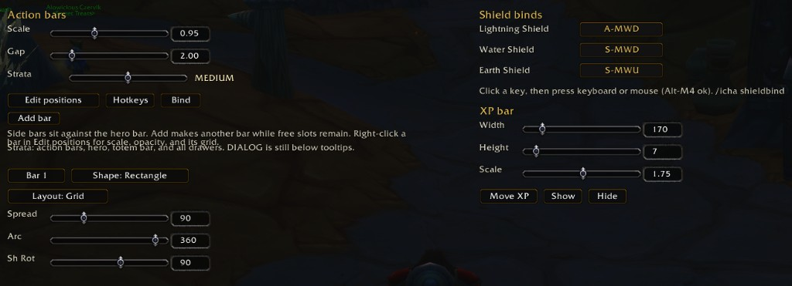
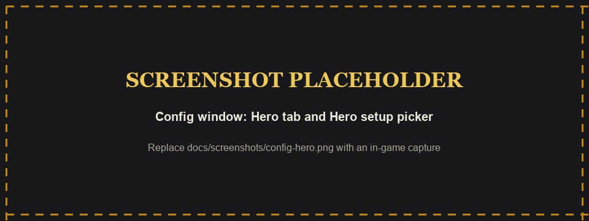
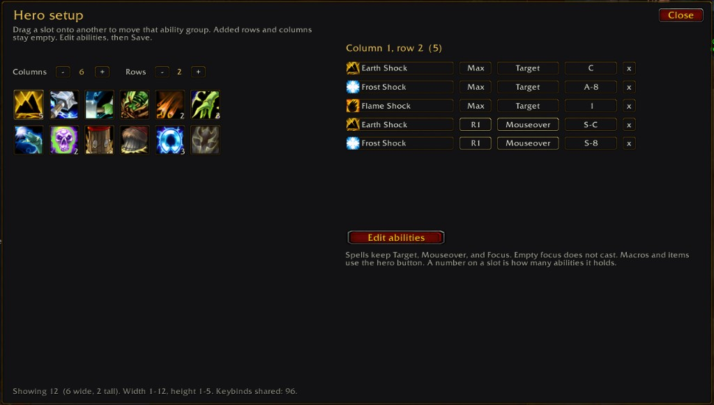

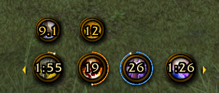
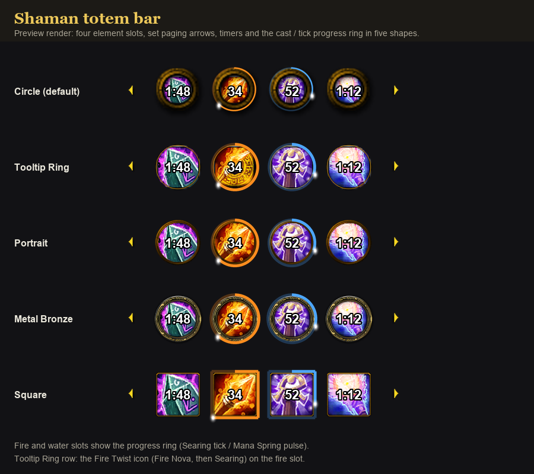

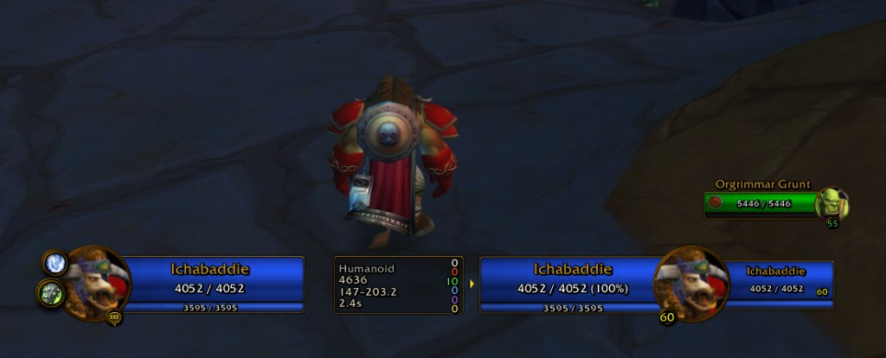
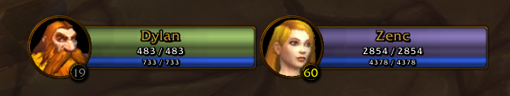
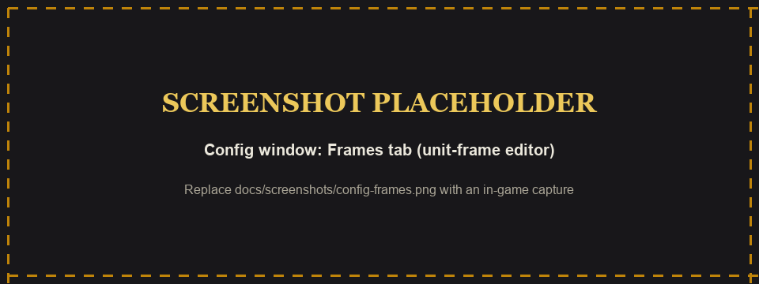
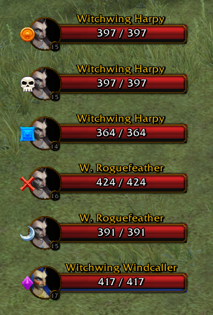

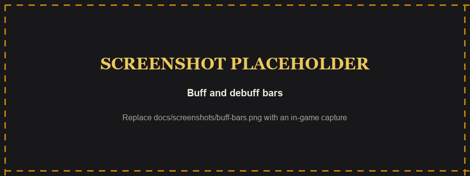
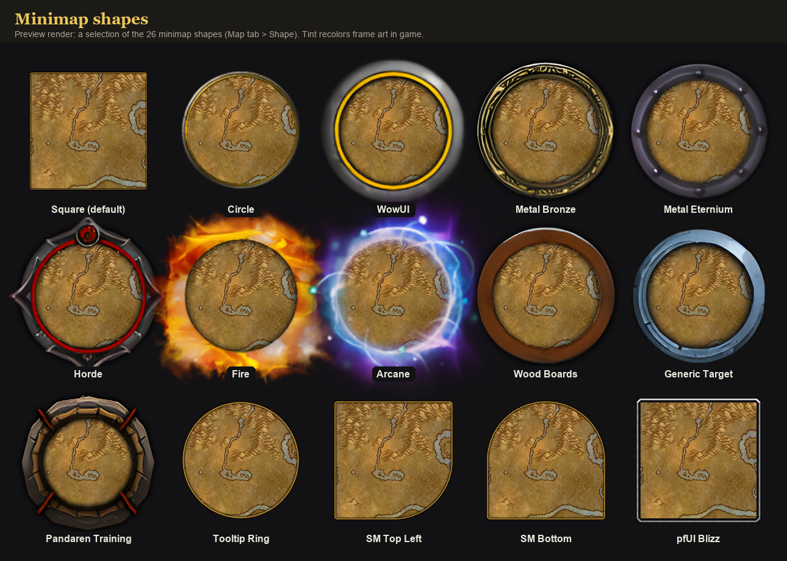
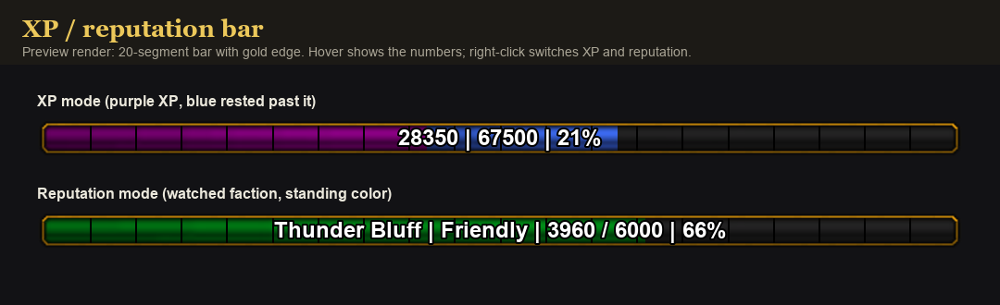

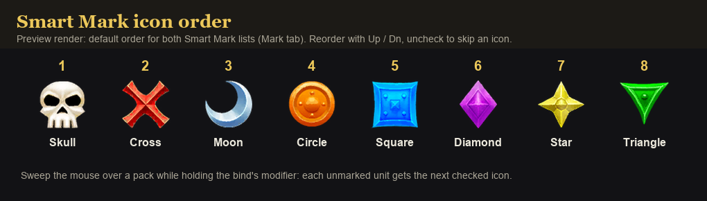
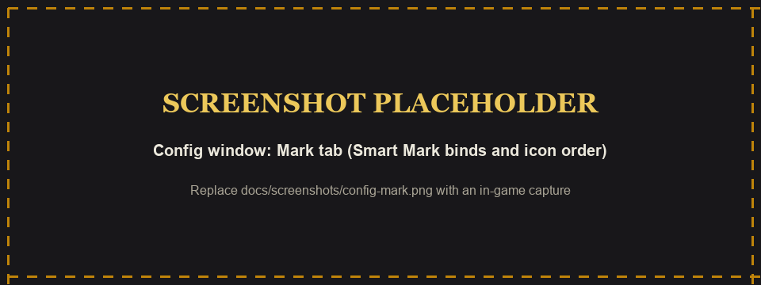
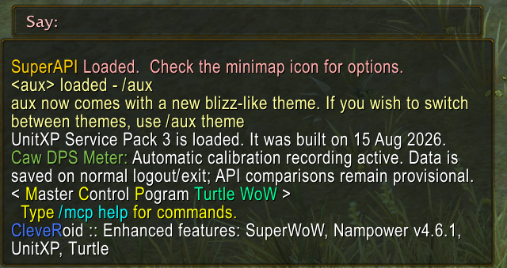

*Images named `preview-*` are rendered from the addon's textures, not taken in game.*

## Install

1. Download the zip from the [latest release](https://github.com/brutaliccus/IchaUI/releases/latest).
2. Exit WoW.
3. Extract it into `World of Warcraft\Interface\AddOns\`. You should see folders like `AddOns\IchaUI`, `AddOns\IchaUI_Bars` and so on, not `AddOns\IchaUI-3.4.1\IchaUI`.
4. Start WoW. A full restart is needed after installing or updating; `/reload` isn't enough.

**Updating:** delete the old `IchaUI` folders first, then extract. Your settings are kept.

### Requirements

- WoW 1.12.1 client.
- ClassicAPI is **required**. IchaUI uses it throughout.
- [SuperWoW](https://github.com/balakethelock/SuperWoW) is **required for IchaPlates** and recommended for everything else. It enables the focus frame, enemy cast bars, totem range checks, vendor prices, and lets the combat tracker, Smart Tab and Smart Mark tell same-named mobs apart.
- Optional: Nampower (for `/focuscast`) and SuperCleveRoidMacros (for `[@focus]` macros).

## Usage

- `/iui` opens the settings window. A fresh install comes fully laid out, so you can play right away.
- `/icha move` unlocks bars and drawers for dragging. Press Esc to save.
- `/icha bind` lets you hover a button and press a key to bind it.
- `/setfocus`, `/clearfocus`, `/targetfocus`, `/focuscast <spell>` for the focus frame.
- **Test UI** in the settings window shows party and raid frames while you're solo.

Type `/icha` for the full command list.

## FAQ

**Something is missing or a texture is a green square.**
Fully restart WoW. New files are only picked up at startup.

**Which addons should I disable?**
IchaUI replaces these, so turn them off:
- Nameplate addons (ShaguPlatesX, pfUI plates, TidyPlates, Aloft). Import your ShaguPlatesX settings first from `/iui` > Plates if you want to keep them.
- LevelRange (level ranges are built into the world map).
- Cooldown count addons (OmniCC, ClassicCooldowns).
- Chat addons (Prat, Chatter, ChatMOD).
- Other UI replacements: pfUI, action bar addons (Bartender, Bongos, Discord Action Bars) and unit frame addons (Luna, XPerl, ag_UnitFrames, DUF).

Keep these, but turn off the overlapping parts:
- ShaguTweaks: turn off WorldMap Window, Cooldown Numbers, the chat modules, Cursor Tooltip and any nameplate modules in `/st`.
- MoveAnything: release the chat edit box, tooltip and world map.
- Minimap skins, buff frame, focus frame and totem timer addons do the same job as IchaUI, so pick one.

Works alongside CawDPSMeter and TWThreat (dock them into chat tabs), pfQuest, Magnify and SuperCleveRoidMacros.

**Where did my minimap buttons go?**
Into the drawer under the minimap. Click the arrow to open it, or set a button to Free on the Map tab.

**Smart Mark won't bind.**
The key must include Shift, Ctrl or Alt (for example `Shift-Q`). In a raid you need lead or assist.

**Found a bug?**
[Open an issue](https://github.com/brutaliccus/IchaUI/issues) with the error text and which client mods you use.

## Credits

- Made by [brutaliccus](https://github.com/brutaliccus).
- IchaPlates is based on ShaguPlatesX by Eric Mauser (Shagu), adapted by Ehawne, derived from [ShaguPlates](https://github.com/shagu/ShaguPlates) and [pfUI](https://github.com/shagu/pfUI). Used under the MIT License.
- The windowed world map is based on [ShaguTweaks](https://github.com/shagu/ShaguTweaks) by Eric Mauser (Shagu), used under the MIT License.
- World map level ranges come from [LevelRange](https://github.com/Spartelfant/LevelRange-Turtle) by Bull3t, Tenyar97, rado-boy, blehz, rafacc87, Diginfotek and Spartelfant.
- Minimap shapes use SexyMap-style masks and pfUI border art.
- Totemic Recall range logic follows CallOfElements.

## License

IchaUI is released under the [MIT License](LICENSE).

IchaPlates (`IchaUI_Plates`) includes MIT-licensed code from ShaguPlatesX; its license text is in `IchaUI_Plates/LICENSE-ShaguPlates.txt`.
